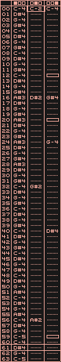

# Tracker3

Tracker3 is a minimalist tracker interface for the 
[Sporth](https://www.github.com/paulbatchelor/sporth) audio programming 
language. As far as trackers go, it is probably the simplest, offering
only 3 channels, 64 steps, 1 pattern to work with: 

It boasts a small set of features:
- 3 Sporth-mappable channels, 64 steps
- Sample accurate controlled clock
- HJKL navigation
- Save/Load/Reload 
- Runt file format for scripting possibilitess
- Usable in Sporth Live coding setup
- Mode for offline / non-Gui use

## Installation

Tracker3 depends on the following:
- [Soundpipe](https://www.github.com/paulbatchelor/soundpipe.git)
- [Sporth](https://www.github.com/paulbatchelor/Sporth.git)
- [Runt](https://www.github.com/paulbatchelor/runt.git)
- GLFW

On Linux, the plugin can be compiled with:

    make

To test it, run:

    sporth -b jack -c 2 test.sp

## Usage

See the file "test.sp" to see example usage.

Tracker3 is implemented as an external Sporth ugen, where it takes 
arguments in the following order :
    - clock: a periodic trigger signal that acts a the main clock. Should be generated
using ugens clock, metro, or dmetro.
    - mode: When non-zero, will start an OpenGL thread for interactive use. 
When 0, it will run in read-only headless mode and not start the GUI thread. This 
useful for rendering things to disk. 
    - notes: This is a string that contains the name of the notes table 
    - gates: This is a string that contains the name of the gates table
    - filename: Name of the file to load/save to. Okay if file doesn't exist.

Two tables are created: the notes table and the gates table. The notes table
contains the note signals for each of the channels as MIDI note numbers. 
These can be converted to frequency using mtof, then fed into oscillators to 
make sounds. The gates table contains gate signals for each of the channels,
1 being "on" and 0 being "off". This signal can be used to create envelope 
signals via the ugens port or adsr. 

## Keybindings
- space: play/stop
- h,j,k,l: move left, down, up, right 
- q,w,e,r,t,y,u,i,o,p: Insert notes (white keys)
- 2,3,5,6,7,9,0: Insert notes (black keys)
- s: save pattern
- l: reload pattern (can load edited file)
- ,: decrease octave
- .: increase octave
- -: decrease edit step
- +: increase edit step
- shift + j, k: jump up/down based on edit step
- x: remove note
- !: insert noteoff
